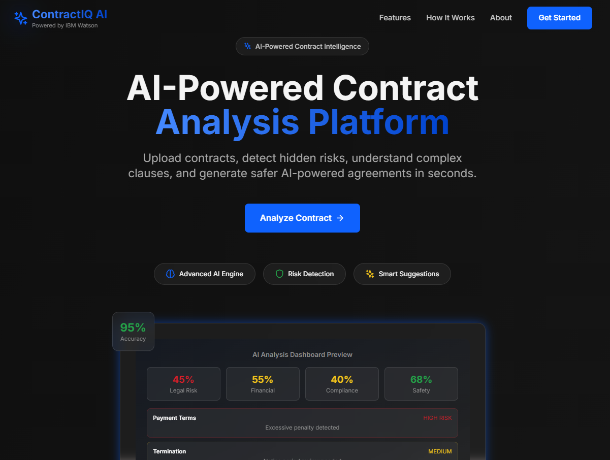
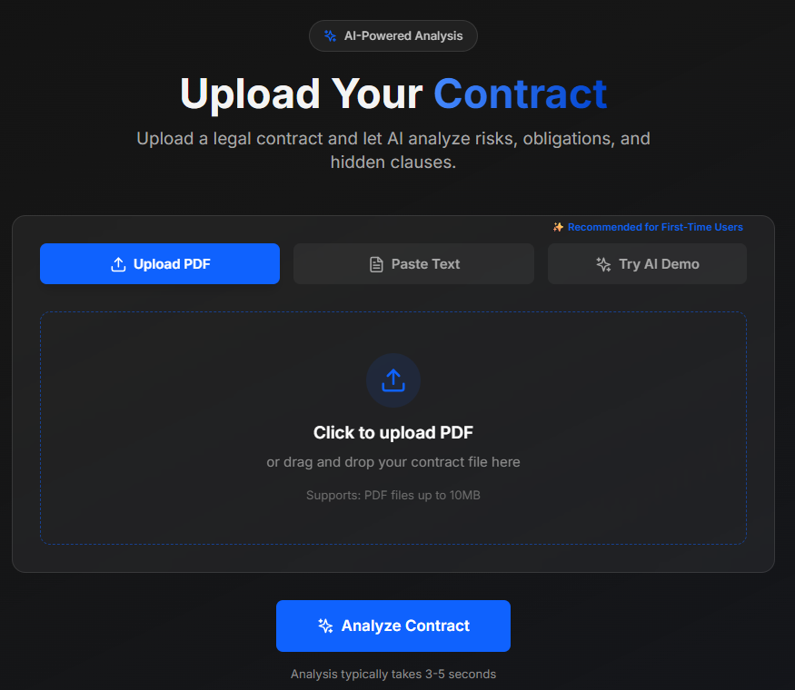
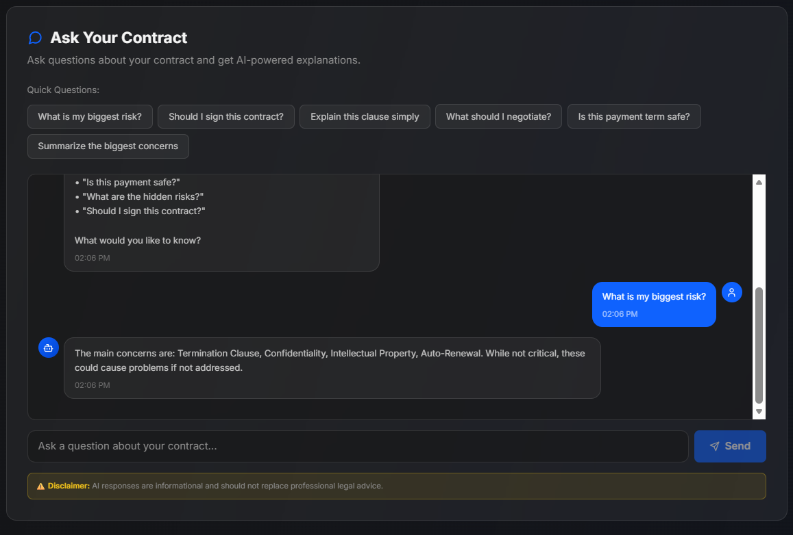
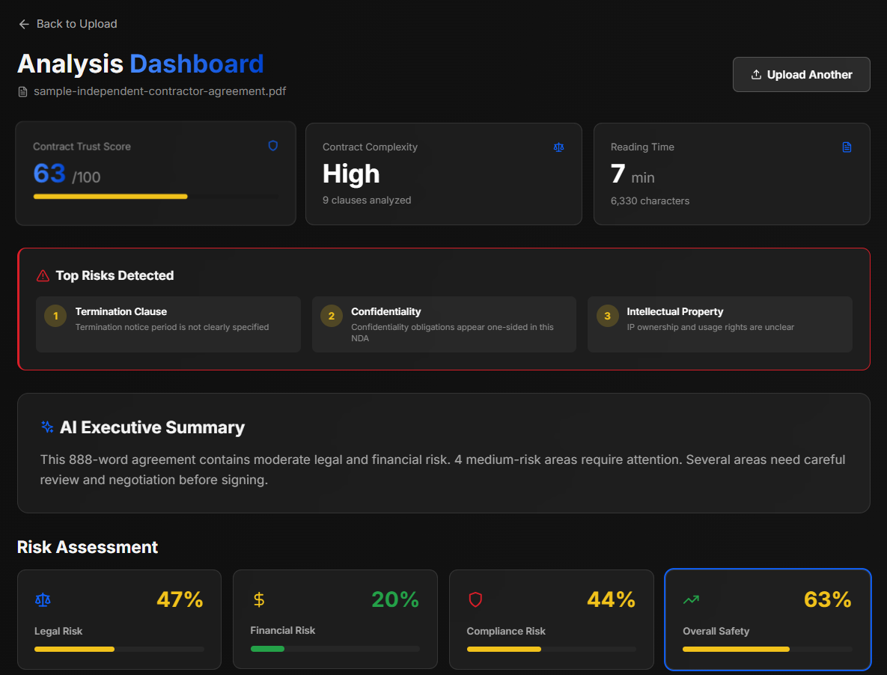

# 📄 ContractIQ AI

## 🧠 AI-Powered Contract Analysis Platform

ContractIQ AI is an intelligent contract analysis system that helps users understand complex legal documents in seconds.  
It detects risky clauses, evaluates legal and financial exposure, provides compliance insights, and generates safer contract improvements using AI.

---

## 🚀 Live Demo
https://your-live-deployed-link.com

---

## 🎯 Problem Statement

Legal contracts are often:
- Difficult to understand
- Time-consuming to review
- Prone to hidden risks
- Risky for non-legal users

Users often sign contracts without fully understanding legal implications.

---

## 💡 Solution

ContractIQ AI solves this by:
- Automatically analyzing contract text
- Detecting risky clauses
- Providing clear AI-generated summaries
- Suggesting safer contract improvements
- Making legal documents understandable for everyone

---

## ⚙️ Features

- 🔍 AI Risk Detection (Legal, Financial, Compliance)
- 📄 Contract Clause Breakdown
- 🧠 Smart AI Suggestions for safer contracts
- ⚡ Instant Contract Summary
- 📊 Risk Scoring Dashboard
- 💬 AI Chat-based Contract Query System
- 📑 Multi-format input (Text / PDF)

---

## 🏗️ Tech Stack

- Frontend: React / Vite / HTML / CSS / JS
- Backend: Node.js / Express (if used)
- AI Engine: NLP-based analysis system
- Styling: Tailwind CSS / CSS3
- Deployment: Vercel / Netlify / Render

---

## 🧠 How It Works

1. Upload Contract (PDF/Text)
2. AI Processes Document
3. Clause Extraction & Analysis
4. Risk Detection Engine
5. AI Suggestions Generated
6. Final Result Dashboard Displayed

---

## ⚙️ How to Run This Project Locally

1. Clone the Repository
```bash
git clone https://github.com/your-username/contractiq-ai.git
cd contractiq-ai
npm install
npm run dev
http://localhost:5173/

---

## 📊 Risk Categories

🔴 High Risk Clauses
🟠 Medium Risk Clauses
🟢 Low Risk Clauses

---

## 🖼️ Screenshots

### 📊 Dashboard


### 📄 Upload Page


### 💬 AI Chat


### 📈 Analysis View

---

## 📌 Key Highlights

- Real-time AI contract analysis
- Simple and user-friendly interface
- Instant legal insights
- Helps non-lawyers understand contracts easily

---

Project Status

✔ Completed for IBM Hackathon 2026
✔ Fully functional MVP
✔ Ready for evaluation and demo

---

Requirements

Node.js v16+
npm installed

---

Contact

Developer: Zara Asif Ali Shaikh
Email: zarashaikh240106@gmail.com

---

Acknowledgement

Built for IBM Hackathon 2026 using AI-based contract intelligence concepts.
